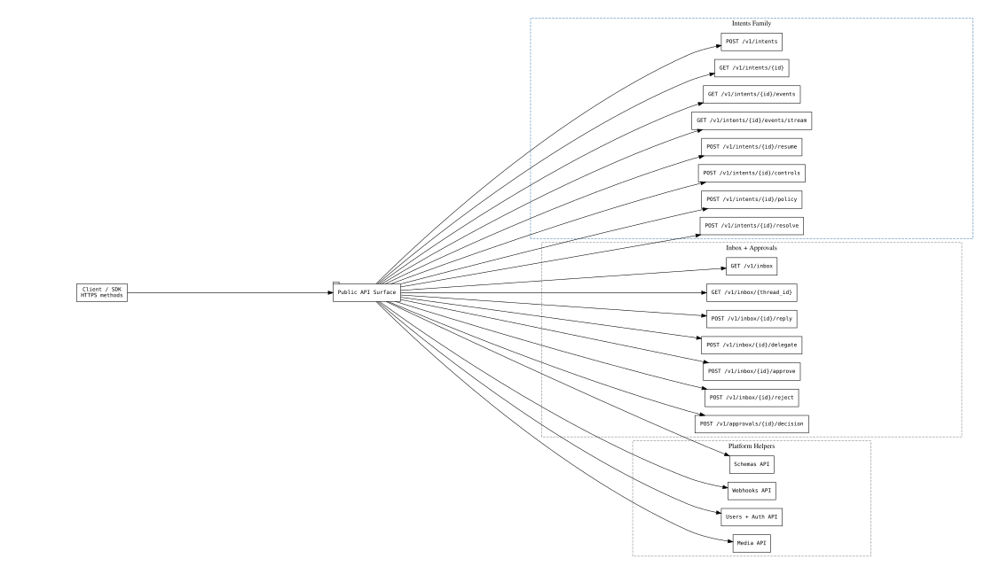
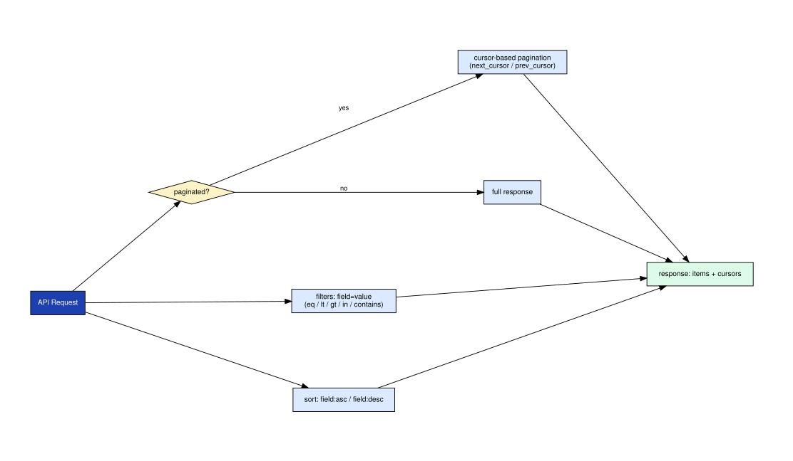

# axme-sdk-java

**Official Java SDK for the AXME platform.** Send and manage intents, observe lifecycle events, handle approvals, and access the enterprise admin surface — built for Java 11+, with clean exception types and request/response maps.

> **Alpha** · API surface is stabilizing. Not recommended for production workloads yet.  
> Alpha access: https://cloud.axme.ai/alpha · Contact and suggestions: [hello@axme.ai](mailto:hello@axme.ai)

---

## What You Can Do With This SDK

- **Send intents** — create typed, durable actions with delivery guarantees
- **Observe lifecycle** — stream real-time state events
- **Approve or reject** — handle human-in-the-loop steps from Java services
- **Control workflows** — pause, resume, cancel, update retry policies and reminders
- **Administer** — manage organizations, workspaces, service accounts, and grants

---

## Install

Add to your `pom.xml`:

```xml
<dependency>
    <groupId>dev.axme</groupId>
    <artifactId>axme-sdk</artifactId>
    <version>0.1.0-alpha</version>
</dependency>
```

---

## Quickstart

```java
import dev.axme.sdk.AxmeClient;
import dev.axme.sdk.AxmeClientConfig;
import dev.axme.sdk.RequestOptions;
import java.util.Map;

public class Quickstart {
    public static void main(String[] args) throws Exception {
        AxmeClient client = new AxmeClient(
            new AxmeClientConfig("https://gateway.axme.ai", "YOUR_API_KEY")
        );

        // Check connectivity
        System.out.println(client.health());

        // Send an intent
        Map<String, Object> intent = client.createIntent(
            Map.of(
                "intent_type", "order.fulfillment.v1",
                "payload", Map.of("order_id", "ord_123", "priority", "high"),
                "owner_agent", "agent://fulfillment-service"
            ),
            new RequestOptions("fulfill-ord-123-001", null)
        );
        System.out.println(intent.get("intent_id") + " " + intent.get("status"));
    }
}
```

---

## API Method Families

The SDK covers the full public API surface:



*D1 families (intents, inbox, approvals) are the core integration path. D2 adds schemas, webhooks, and media. D3 covers enterprise admin. The Java SDK implements all three tiers.*

---

## Pagination, Filtering, and Sorting

List endpoints return paginated results. The SDK handles cursor-based pagination:



*All list methods return a `cursor` field for the next page. Pass it as `after` in the next call. Filter and sort parameters are typed per endpoint.*

```java
// Paginate through intents
Map<String, Object> page = client.listIntents(
    Map.of("status", "PENDING", "limit", 20),
    RequestOptions.none()
);

while (page.get("cursor") != null) {
    page = client.listIntents(
        Map.of("after", page.get("cursor"), "limit", 20),
        RequestOptions.none()
    );
}
```

---

## Approvals

```java
Map<String, Object> inbox = client.listInbox(
    Map.of("owner_agent", "agent://manager", "status", "PENDING"),
    RequestOptions.none()
);

for (Object item : (List<?>) inbox.get("items")) {
    Map<?, ?> entry = (Map<?, ?>) item;
    client.resolveApproval(
        (String) entry.get("intent_id"),
        Map.of("decision", "approved", "note", "Reviewed and approved"),
        new RequestOptions(null, null)
    );
}
```

---

## Enterprise Admin APIs

The Java SDK includes the full service-account lifecycle surface:

```java
// Create a service account
Map<String, Object> sa = client.createServiceAccount(
    Map.of("name", "ci-runner", "org_id", "org_abc"),
    new RequestOptions("sa-ci-runner-001", null)
);

// Issue a key
Map<String, Object> key = client.createServiceAccountKey(
    (String) sa.get("id"),
    new RequestOptions(null, null)
);

// List service accounts
client.listServiceAccounts("org_abc", RequestOptions.none());

// Revoke a key
client.revokeServiceAccountKey(
    (String) sa.get("id"),
    (String) key.get("key_id"),
    RequestOptions.none()
);
```

Available methods:
- `createServiceAccount` / `listServiceAccounts` / `getServiceAccount`
- `createServiceAccountKey` / `revokeServiceAccountKey`

---

## Nick and Identity Registry

```java
Map<String, Object> registered = client.registerNick(
    Map.of("nick", "@partner.user", "display_name", "Partner User"),
    new RequestOptions("nick-register-001", null)
);

Map<String, Object> check = client.checkNick("@partner.user", RequestOptions.none());

Map<String, Object> renamed = client.renameNick(
    Map.of("owner_agent", registered.get("owner_agent"), "nick", "@partner.new"),
    new RequestOptions("nick-rename-001", null)
);

Map<String, Object> profile = client.getUserProfile(
    (String) registered.get("owner_agent"),
    RequestOptions.none()
);
```

---

## Repository Structure

```
axme-sdk-java/
├── src/
│   ├── main/java/dev/axme/sdk/
│   │   ├── AxmeClient.java        # All API methods
│   │   ├── AxmeClientConfig.java  # Configuration
│   │   ├── RequestOptions.java    # Idempotency key and correlation ID
│   │   └── AxmeAPIException.java  # Typed exception
│   └── test/                      # JUnit test suite
└── docs/
    └── diagrams/                  # Diagram copies for README embedding
```

---

## Tests

```bash
mvn test
```

---

## Related Repositories

| Repository | Role |
|---|---|
| [axme-docs](https://github.com/AxmeAI/axme-docs) | Full API reference and integration guides |
| [axme-spec](https://github.com/AxmeAI/axme-spec) | Schema contracts this SDK implements |
| [axme-conformance](https://github.com/AxmeAI/axme-conformance) | Conformance suite that validates this SDK |
| [axme-examples](https://github.com/AxmeAI/axme-examples) | Runnable examples using this SDK |
| [axme-sdk-python](https://github.com/AxmeAI/axme-sdk-python) | Python equivalent |
| [axme-sdk-typescript](https://github.com/AxmeAI/axme-sdk-typescript) | TypeScript equivalent |

---

## Contributing & Contact

- Bug reports and feature requests: open an issue in this repository
- Alpha access: https://cloud.axme.ai/alpha · Contact and suggestions: [hello@axme.ai](mailto:hello@axme.ai)
- Security disclosures: see [SECURITY.md](SECURITY.md)
- Contribution guidelines: [CONTRIBUTING.md](CONTRIBUTING.md)
